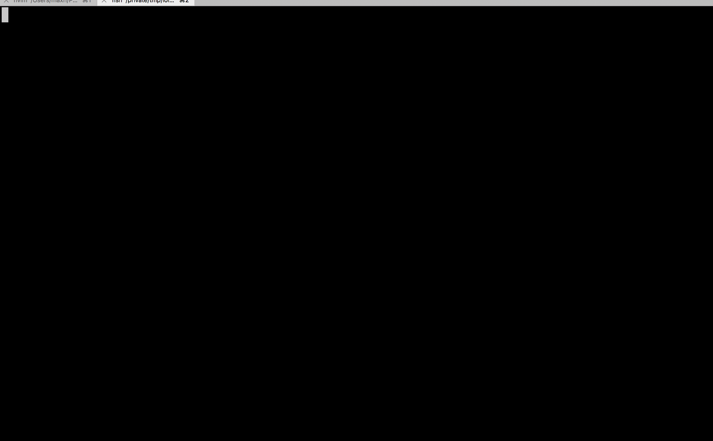
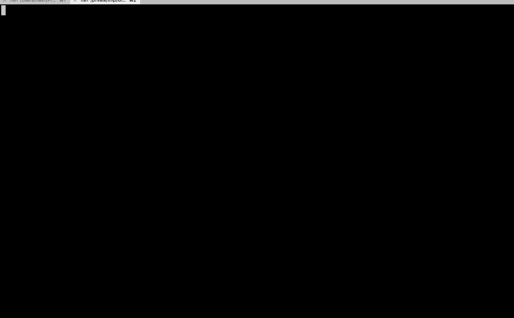

# progress

Progress is a new standard for how CLI application progress bars should behave. This is a super innovative and game-changing CLI UI library.

Totally joking...

There are two different progress bars that can be made. The first is when the maximum value is known:


And one where the maximum value is not known



The code is very simple. `hack_russia.go` is shown below:


```
package main

import (
        "time"

        "github.com/t94j0/progress"
)

const Max = 10

func main() {
        tracker := progress.CreateTrackerMax("Hacking Russia", Max)
        for i := 0; i < Max; i++ {
                time.Sleep(time.Second * 1)
                tracker.Increment()
        }
}
```

and `parse_files.go` is shown here:

```
package main

import (
        "time"

        "github.com/t94j0/progress"
)

func main() {
        tracker := progress.CreateTracker("Files")
        for i := 0; i < 5; i++ {
                tracker.Increment()
                time.Sleep(time.Second)
        }
}
```
